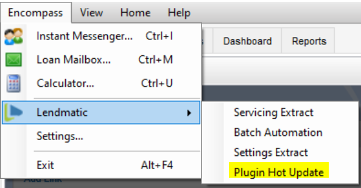
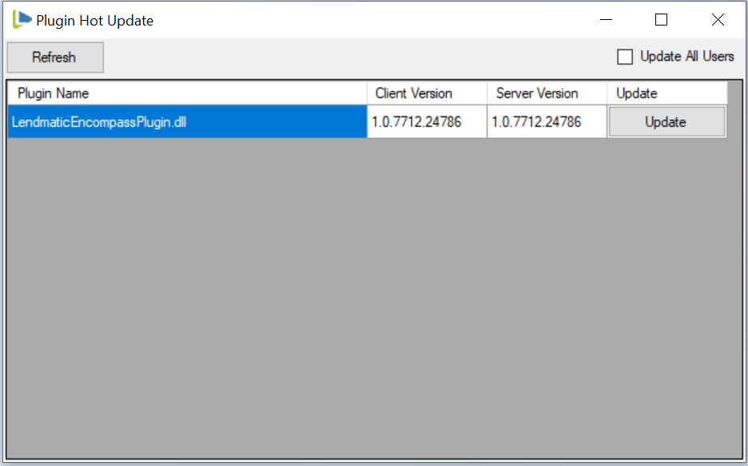

## Encompass Hot Update Plugin

**Introduction:** Have you ever wanted to update an Encompass plugin and have it go into effect without restarting the Encompass Smartclient? This plugin is your ticket. Huge time saver during development testing/debugging by enabling quick deployments of plugin builds. This plugin will also allow Encompass admins to upload new plugin updates and instantly push the update to all logged in users. No need to have users log out and back in!

**Disclaimer** Test throughougly before using in your production Encompass instance!

**How it works:** 

Typically Encompass plugins are loaded in this fashion:

- Encompass smartclient downloads all dll's that were uploaded using the FormBuilder Manage Customizations.
- Each dll assembly is loaded into the primary AppDomain.
- The loaded assemblies are probed for the [Plugin] attribute.
- Each class with the [Plugin] attribute has it's constructor called using reflection.
- The plugin subscribes to Encompass events, which prevents it from being garbage collected.
- The plugin instance lives for the duration of the Encompass session.

Using the Hot Update Plugin, the process is changed to:
- Only the HotUpdatePlugin uses the standard encompass [Plugin] attribute and has it's constructor called by the Encompass client.
- The HotUpdatePlugin then probes all loaded assemblies for a new attribute called [HotUpdatePlugin].
- Each class with the [HotUpdatePlugin] attribute has it's constructor called using reflection.
- The running plugin instances are tracked in a Dictionary to enable the lifecycle management.
- To hot update the plugin, a new plugin version is first uploaded using FormBuilder Manage Customizations.
- Using the Plugin Hot Update form (in the Lendmatic top menu) an Encompass admin starts the update.

- The plugin is downloaded from the Encompass server and saved to the plugin cache folders.
- The currently running plugin is Disposed and the instances removed.
- The new plugin assembly is loaded into the AppDomain and all classes with [HotUpdatePlugin] are instantiated.

**Using** 

There are some changes required in order make a plugin compatible with the Hot Update loader.

- Your plugin will need to swap the standard [Plugin] to [HotUpdatePlugin] attribute from the Lendmatic.HotUpdatePlugin.dll.
- Your plugin will need to implement IDisposable ON THE SAME CLASS that is annotated with [HotUpdatePlugin].
```csharp
[HotUpdatePlugin]
public class PluginEntry : IDisposable
{
	public PluginEntry()
	{
		Plugins.Start();
	}

	public void Dispose()
	{
		Plugins.Dispose();
	}
}
```
- If your Encompass event handlers are wired up in a separate class, be sure to implement IDisposable anywhere those event handlers are created.
```csharp
public void Dispose()
{

	LoansScreen loan = (LoansScreen)EncompassApplication.Screens[EncompassScreen.Loans];

	loan.FormLoaded -= Base_FormLoaded;
	EncompassApplication.LoanClosing -= Base_LoanClosing;
	EncompassApplication.LoanOpened -= Base_LoanOpened;
	EncompassApplication.Login -= Base_Login;
	FormWrapper.FormOpened -= Base_NativeFormLoaded;
	EncompassApplication.Session.DataExchange.DataReceived -= Base_DataExchangeReceived;

	Loan encLoan = EncompassApplication.CurrentLoan;

	if (encLoan != null)
	{
		encLoan.BeforeCommit -= Base_BeforeCommit;
		encLoan.FieldChange -= Base_FieldChange;
		encLoan.Committed -= Base_Committed;
		encLoan.BeforeCommit -= Base_BeforeCommit;
		encLoan.LogEntryAdded -= Base_LogEntryAdded;
		encLoan.LogEntryChange -= Base_LogEntryChanged;
		encLoan.LogEntryRemoved -= Base_LogEntryRemoved;
		encLoan.BeforeMilestoneCompleted -= Base_BeforeMilestoneCompleted;
		encLoan.MilestoneCompleted -= Base_MilestoneCompleted;
	}

}
```


**Installation**

- [Download](https://github.com/mikecowgill/encompass-hotupdate-plugin/releases) or build this project to get the Lendmatic.HotUpdatePlugin.dll
- Add a reference from your plugin to Lendmatic.HotUpdatePlugin.dll
- Change your plugin entrypoint attribute to [HotUpdatePlugin]
- Implement IDisposable as described above
- Upload Lendmatic.HotUpdatePlugin.dll to Plugins using FormBuilder Manage Customizations
- Rebuild your plugin and upload using FormBuilder Manage Customizations

**Admin Usage**

- Load the Hot Update UI

- The UI will show the current client version and the server version of all plugins with the [HotUpdatePlugin] attribute.
- The 'Update All Users' option will send a notification to all logged in Encompass clients to download and hot update the plugin. (using the Encompass DataExchange interfaces)
- Without 'Update All Users' only your local encompass client will be hot updated with the new plugin. Use this for testing/debugging in development.
- To hot update a plugin, click the "Update" button on the row for the plugin to be updated.


**Caveats**

Due to Encompass loading all plugins into the primary AppDomain, there will be multiple copies of the assembly loaded until Encompass is shut down. This has some implications:

- If event handlers are NOT removed in the plugin dispose method, the old plugin will still be active.
- Static methods and properties can never be disposed or garbage collected. Old plugins that still exist in the AppDomain will have their static fields still allocating memory.

## License
[MIT](https://choosealicense.com/licenses/mit/)
